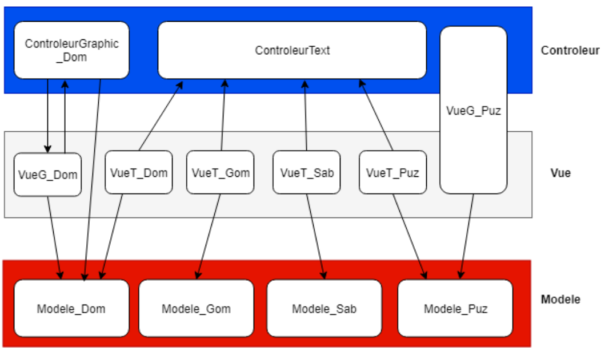
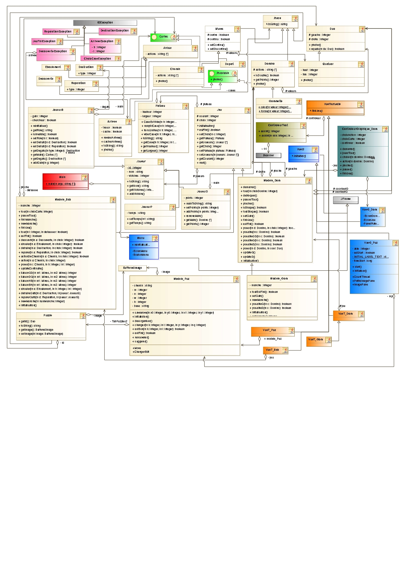

# Famille de Jeux   

    

*Projet réalisé en binôme dans le cadre du cours "Programmation Orientée Objet et Interfaces Graphiques"*   
**Auteurs : [Joël Hamilcaro](https://github.com/Joel-Hamilcaro/) et [Jie Tu](https://github.com/jie-tu)**

## Introduction

Dans le cadre de ce projet, nous devions programmer une plateforme
de jeux comprenant les jeux suivants : Les Dominos, Les Domino-Gommettes, Le
Puzzle et le Saboteur. Dans ce qui suit, nous allons décrire les choix et les étapes
principales de la réalisation de notre projet.

## Modélisation

### 1. – Choix de conception concernant les jeux

Nous allons tout d’abord expliquer nos choix concernant les jeux que nous
devons réaliser.

#### 1.1. – Domino

Le jeu de Domino reprend les règles classiques. La personne qui commence
est celui ayant un domino double avec le plus de points, ou à défaut, le domino
(non-double) avec le plus de points. Quand un joueur est bloqué, il pioche une carte
et passe son tour. Le gagnant est celui ayant le moins de points sur ses dominos
restants. (donc celui qui n’a plus de domino gagne).

#### 1.2. – Domino-Gommette

Le Domino-Gommette reprends les règles du domino classiques. Nous avons
choisi qu’il se déroule en 3 manches : dans la première on associe les formes, dans
la deuxième les couleurs, dans la troisième les formes et les couleurs.

#### 1.3. – Saboteur  

Le Saboteur reprend presque toutes les règles d’un jeu du Saboteur standard.
Cependant, à ce stade du projet nous ne savions pas encore le (ou les) interface(s)
graphique(s) nous allions coder. Nous nous sommes donc adaptés aux images
fournies qui étaient disponibles. Dans notre jeu il n’y a pas de cartes Reparation
double (pouvant réparer deux types d’outils) et il n’y a pas non plus de cartes
"Pepites d’or". Le partage des gains se fait de la manière suivante : si les Saboteurs
ont gagné ils se partagent 1000 pépites d’or. Sinon, le chercheur qui a découvert le
trésor prend 500 pépites et les autres chercheurs se partagent les 500 pépites d’or
restantes.

#### 1.4. – Tableau récapitulatif

| Jeu | Règles particulières |
|:---:|:--------------------:|
|Domino | Standard |
|Dominos-Gommettes | 3 manches : formes, couleurs, mixte |
|Saboteur | Partage de 1000 pépites entre les vainqueurs |

#### 1.5. – Cas du Puzzle

Le jeu du Puzzle est un cas particulier. Nous avons pensé le jeu du Puzzle de
la manière suivante, on utilise une image qui est découpée en sous-images. Ces
sous-images sont alors mélangées et forment une nouvelle configuration sur le
plateau, le but étant de reconstituer l’image de départ en échangeant les positions
des pièces de puzzle deux à deux.

### 2. – Choix du modèle

Cette partie décrit une vision globale du choix des classes que nous avons
créées.

### 2.1. – Les Objets importants

#### Pièces

Dans un premier temps, nous devions mettre en place un modèle qui nous
permettait de programmer ces jeux de manière stratégique. Il fallait d’abord distinguer
les points communs et le différences de chaque jeux. Tout d’abord, nous avons
remarqué que tous les jeux utilisaient des pièces que l’on pouvait associés entre
elles selon certains critères spécifique : la valeur pour les Dominos, la cohérence
des formes pour le Puzzle, la couleur et la forme pour les Domino-Gommettes et la
cohérence entre les chemins créés par les cartes du jeu du Saboteur. Nous avons
donc décider de modéliser ces pièces par une classe abstraite "Piece".
Ainsi, dans notre modèle, les Dominos, les Domino-Gommettes, les Mines
(cartes Chemins, Départs et Arrivées), et les pièce des Puzzle sont des objets héritant
directement de l’objet Pièce (sauf Domino-Gommettes qui hérite indirectement de
Pièce car il hérite d’abord de Domino).

#### Plateau

Dans tous les jeux, l’action se déroule sur un plateau. Nous avons décidé de
créer un objet de type "Plateau", qui est en fait une matrice pouvant contenir
des pièces (Dominos, Cartes Chemins, Domino-Gommettes, ... etc). Tous les jeux
utilisent un objet de type Plateau, sauf le Puzzle qui est un cas particulier. Dans
notre modèle, le plateau du puzzle n’est pas un objet de type Plateau. La manière2. Choix du modèle
dont nous avons conceptualiser le Puzzle n’impliquait aucune utilisation des
méthodes de la classe Plateau, contrairement aux autres jeux. Selon nous, il était
plus simple et logique d’utiliser directement un tableau pièces de Puzzle.
La classe Plateau et la classe Pièces forment le pilier de l’architecture de nos
jeux.

#### Duo et Quatuor

Ensuite, nous avons remarqué que le critère d’association entre les pièces
mettait en jeu deux ou quatre valeurs. En effet, pour un Domino nous avons le
chiffre sur la première moitié du domino, le chiffre sur l’autre moitié (ou le symbole
dans le cas du Domino-Gommette). De même, pour une carte "Chemin" dans le jeu
du Saboteur, chaque coté de la carte forme soit un chemin fermé, soit un chemin
ouvert. Pour factoriser notre code, nous avons décider de créer des Objets "Duo" et
"Quatuor" qui traite directement les valeurs des objets en question. L’objet "Duo"
nous a aussi servi d’identifiant pour les pièces de Puzzle. En effet, pour chaque
pièce de Puzzle, l’identifiant, de type Duo, correspond aux coordonnées x et y de sa
position prévue (si le puzzle était terminé).

### 2.2. – Les interfaces fonctionnelles

Dans notre programme, nous avons certaines pièces qui ont un comportement
particulier. Certaines pièces pourront avoir plusieurs orientations possibles (comme
les Dominos, les cartes Chemins, les Domino-Gommettes) et d’autre non (une Pièce
de Puzzle n’a qu’une seule orientation) On a donc décidé d’ajouter une interface
"Pivotable" dans notre modélisation. De même, nous avons ajouté l’interface Cartes.
En effet, les Cartes du Saboteur ne sont pas toutes des pièces (on ne peut pas poser
les cartes Actions) mais elle forment une même entités (on les mélangent dans la
pioches, elle font partie de la "main" d’un joueur, ... etc).

### 2.3. – Les modèles et les vues

Dans notre modélisation, nous avons appliqué le principe de séparation du
modèle et de la vue. Notre schéma est le suivant : un jeu est un modèle contenant
toutes les méthodes à exécuter. L’utilisateur interagit avec la vue (via un Scanner,
ou une interface graphique) et la vue appelle un contrôleur qui gère les entrées de
l’utilisateur. Nous avons décidé de modéliser
Dans notre cas, chaque jeu a sa vue textuelle (console) qui est géré par un
contrôleur (toutes les vues textuelles ont le même contrôleur). Concernant les
interfaces graphiques, nous avons décidé de faire une vue graphique pour le
domino et pour le Puzzle. La vue graphique du Domino agit sur son Contrôleur et
inversement. Ce contrôleur agit sur le modèle du Domino. Concernant le Puzzle, la
Vue Graphique a pour contrôleur lui-même et agit sur le modèle.

## 3. – Représentation graphique du modèle

## 3.1. – Model-View



## 3.2. – Diagramme de classes



# Programmation

## 1. – Etapes principales et partie traitées

Concernant les étapes de programmation, nous avons tout d’abord commencé
par programmer ensemble les classes mères, les classes abstraites et les interfaces.
(Pièces, Jeu, Duo, Cartes, Pivotable ect... )
Ensuite, nous nous sommes répartis le travail pour le codages des différents
jeux sous vue textuelle. De plus, nous avons chacun fait une interface graphique
pour un jeu (un pour le Domino, l’autre pour le Puzzle). Pour finir, nous avons fait
ensemble l’interface graphique pour le menu de démarrage.

## 2. – Problèmes connus

Nous avions rencontrés différents problème durant ce projet.
— Concernant la modélisation du Jeu du Puzzle, nous avions du changer notre
modélisation à plusieurs reprises, à un stade assez avancé du projet. Les
premières étaient beaucoup trop complexes pour être retenu.
— Le jeu du Saboteur présentait de nombreux problèmes fonctionnel au
moment de sa programmation. Par exemple, on pouvait accéder au trésor
sans que le chemin soit complétement continu entre le départ et l’arrivée.
Ces problèmes étaient dus fait que la structure du code était trop proche de
celle du domino (qui ne verifie que les valeurs en bout de chemin, et non la
continuité totale du chemin). Ce problème a été résolu.
— La complexité du jeu du Saboteur nous a poussé à créer des classes d’Exceptions,
qui n’étaient pas prévu à la base, afin de gérer tous les cas possibles.Conclusion et pistes d’extensions
Ainsi, les jeux ont tous été terminés avec une vue textuelle séparée du modèle.
Cette structure nous permettrait d’ajouter, sans modifier notre modèle, des interfaces
graphiques pour les jeux restants (Saboteur, Domino-Gommette). D’autres pistes
d’extensions possibles seraient un système de sauvegarde des résultats ou une
intelligence artificielle qui jouerait les coups automatiquement afin de pouvoir
simuler une véritable partie.

# Annexe  

## Liste de jeux

- Domino
- Domino-Gommette
- Saboteur
- Puzzle

## Dans le dossier courant se trouve :

_ Le fichier : README.md

_ Le répertoire src/
     (contient tous les fichiers de Java)

_ Le répertoire Images/
     (contient l'image pour le Puzzle)

_ Le répertoire Imagefournies-20181220/
    (contient les images pour Domino et Saboteur)

____________________________________________________________________________

## Lancement  (Dans repertoire "src", lancer un Terminal) :

- compiler les codes java ```javac *.java```
- lancer les jeux ```java Main```

___________________________________________________________________________
